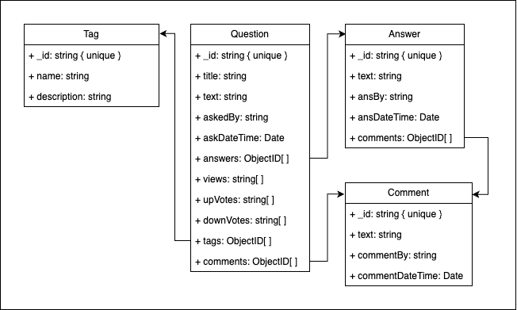

This project is a user management service for a community messaging app like stack overflow. It provides a set of APIs to handle user-related operations such as creating a new user, adding a comment, retrieving user details, updating user information, deleting a user, and authenticating a user.

## Features

- **Create User**: Save a new user to the database.
- **Retrieve User**: Fetch user details by username.
- **Update User**: Update user information in the database.
- **Delete User**: Remove a user from the database by their username.
- **Authenticate User**: Verify user credentials for login.
- **Login**: Allow users to log in to the application.
- **Fetch Messages**: Retrieve all messages in descending order of their date and time.
- **Reset Password**: Allow users to reset their password.
- **Create Question**: Save a new question to the database.
- **Create Answer**: Save a new answer to a question in the database.
- **Fetch Questions**: Retrieve questions by filter or by ID.
- **Upvote/Downvote Question**: Allow users to upvote or downvote a question.
- **Add Comment**: Enable users to add comments to questions or answers.
- **Fetch Tags**: Retrieve tags along with the number of questions associated with them.

## Technologies Used

- **Node.js**
- **Express.js**
- **MongoDB**
- **Mongoose**
- **TypeScript**

## Database Architecture

The schemas for the database are documented in the directory `server/models/schema`.
A class diagram for the schema definition is shown below:

## API Routes

#### `/answer`

| Endpoint   | Method | Description      |
| ---------- | ------ | ---------------- |
| /addAnswer | POST   | Add a new answer |

#### `/comment`

| Endpoint    | Method | Description       |
| ----------- | ------ | ----------------- |
| /addComment | POST   | Add a new comment |

#### `/messaging`

| Endpoint     | Method | Description           |
| ------------ | ------ | --------------------- |
| /addMessage  | POST   | Add a new message     |
| /getMessages | GET    | Retrieve all messages |

#### `/question`

| Endpoint          | Method | Description                     |
| ----------------- | ------ | ------------------------------- |
| /getQuestion      | GET    | Fetch questions by filter       |
| /getQuestionById/ | GET    | Fetch a specific question by ID |
| /addQuestion      | POST   | Add a new question              |
| /upvoteQuestion   | POST   | Upvote a question               |
| /downvoteQuestion | POST   | Downvote a question             |

#### `/tag`

| Endpoint                   | Method | Description                                   |
| -------------------------- | ------ | --------------------------------------------- |
| /getTagsWithQuestionNumber | GET    | Fetch tags along with the number of questions |
| /getTagByName/             | GET    | Fetch a specific tag by name                  |

#### `/user`

| Endpoint       | Method | Description                    |
| -------------- | ------ | ------------------------------ |
| /signup        | POST   | Create a new user account      |
| /login         | POST   | Log in as a user               |
| /resetPassword | PATCH  | Reset user password            |
| /getUser/      | GET    | Fetch user details by username |
| /deleteUser/   | DELETE | Delete a user by username      |
